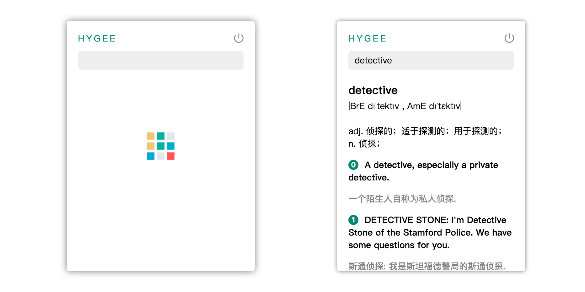

# HYGEE

**A minimalist dictionary in menubar.**

Meet unfamiliar words ? Just click HYGEE in menubar and get meanings in 5 seconds.

## Features

- Type once before looking up to enhance the pronunciation and spelling.
- Minimalist. **No** English news, **no** ads, **no** vocabulary books that will slow down your query.
- Search and show in menu bar, with little space occupied.
- Nice and smooth interface.

## Usage

- Press <kbd>enter<kbd/>to search.
- Press <kbd>esc</kbd> to clear the input field.
- Click `Power Icon` to close.

 